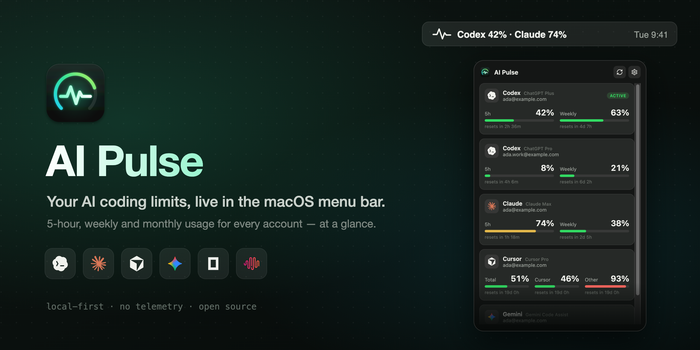
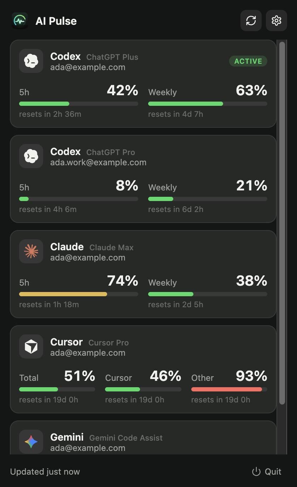
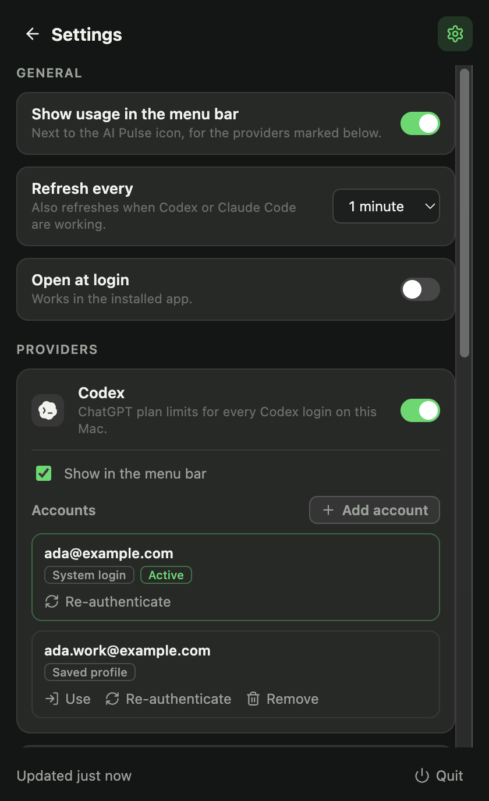
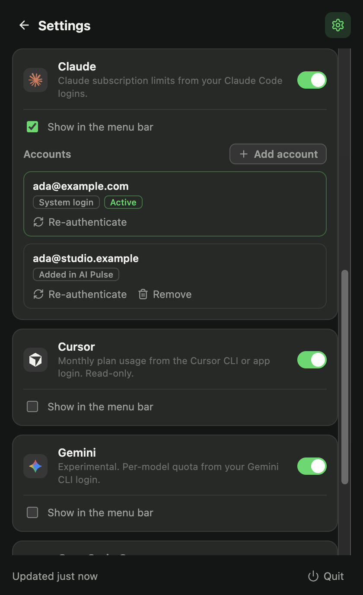

<p align="center">
  
</p>

<p align="center">
  <a href="https://github.com/xfelipealves/AI-Pulse/actions/workflows/ci.yml"></a>
  <a href="https://github.com/xfelipealves/AI-Pulse/releases/latest"></a>
  
  
  <a href="LICENSE"></a>
</p>

<p align="center">
  <b>AI Pulse</b> keeps an eye on your AI coding plans so you don't hit a limit mid-task.<br>
  Codex, Claude Code, Cursor, Gemini CLI, OpenCode Go and MiniMax — every account, live, one click away.
</p>

---

## Why

Coding agents have rolling limits: a 5-hour window, a weekly cap, a monthly plan. Each tool shows them somewhere different, if at all. AI Pulse puts all of them in one place — the macOS menu bar — and keeps them current while you work.

- **See it without looking** — the menu bar shows usage of the tools you pick, e.g. `Codex 42% · Claude 74%`.
- **Every account** — multiple Codex and Claude Code logins side by side, each with its email.
- **Real time** — refreshes every minute and right after Codex or Claude Code do work.
- **Account management** — add, re-authenticate, switch and remove logins without touching config files.
- **Local-first** — no server, no telemetry. Tokens go only to their own provider.

## Screenshots

<table>
  <tr>
    <td align="center"><br><sub>Usage for every account</sub></td>
    <td align="center"><br><sub>Settings</sub></td>
    <td align="center"><br><sub>Account management</sub></td>
  </tr>
</table>

<sub>Screenshots use fictional demo accounts (<code>npm run screenshots</code>).</sub>

## Supported providers

| Provider        | What you see                                     | Where the login comes from                                           | Default |
| --------------- | ------------------------------------------------ | -------------------------------------------------------------------- | ------- |
| **Codex**       | 5h and weekly, per account                       | `~/.codex/auth.json` and saved profiles in `~/.codex/auth-profiles/` | On      |
| **Claude Code** | 5h and weekly, per account                       | macOS Keychain (`Claude Code-credentials`)                           | On      |
| **Cursor**      | Total, Cursor models and other models this cycle | Cursor CLI session in the Keychain, or the Cursor app (read-only)    | On      |
| **Gemini CLI**  | Quota per model family _(experimental)_          | `~/.gemini/oauth_creds.json`                                         | Off     |
| **OpenCode Go** | 5h, weekly and monthly                           | API key in Settings, `OPENCODE_API_KEY`, or OpenCode's saved key     | Off     |
| **MiniMax**     | Interval and weekly Coding Plan quota            | API key in Settings                                                  | Off     |

Providers that aren't signed in on your Mac simply don't appear. Turn providers on or off in **Settings**.

## Install

### Download

1. Grab the latest `AI Pulse-<version>-arm64.dmg` from **[Releases](https://github.com/xfelipealves/AI-Pulse/releases/latest)** (Apple silicon).
2. Drag **AI Pulse** to Applications.
3. The app is not notarized yet, so macOS blocks the first launch. Right-click the app → **Open**, or run:

   ```bash
   xattr -dr com.apple.quarantine "/Applications/AI Pulse.app"
   ```

### Build from source

Requires macOS, Node.js 20.19+ and npm 10+.

```bash
git clone https://github.com/xfelipealves/AI-Pulse.git
cd AI-Pulse
npm ci
npm run dev            # run in development
npm run package:mac    # build dist/mac-arm64/AI Pulse.app, a .dmg and a .zip
```

## Using AI Pulse

- **Click** the pulse icon in the menu bar to open the window; **right-click** for Refresh and Quit.
- Bars fill as you use a plan and turn yellow at 70% and red at 90%. Each shows when it resets.
- The gear opens **Settings**:
  - **General** — usage in the menu bar, refresh interval (30 s – 5 min), open at login.
  - **Providers** — on/off and menu-bar visibility per provider, API keys (stored encrypted with the macOS Keychain).
  - **Accounts** — for Codex and Claude Code.

### Accounts

| Action              | Codex                                                                   | Claude Code                                                                      |
| ------------------- | ----------------------------------------------------------------------- | -------------------------------------------------------------------------------- |
| **Add account**     | Runs `codex login`; the login is saved to `~/.codex/auth-profiles/`     | Runs `claude auth login` in its own `CLAUDE_CONFIG_DIR`; paste the browser code  |
| **Re-authenticate** | Signs in again and updates the saved profile                            | Signs in again in the same config directory                                      |
| **Use**             | Makes a saved profile the active login (the current one is saved first) | Not offered — Claude rotates refresh tokens, so copies would sign each other out |
| **Remove**          | Deletes the saved profile (never the active login)                      | Deletes the added login and its Keychain item                                    |

## How it works

```
src/
├── main/                 Electron main process
│   ├── providers/        one module per provider → accounts with usage windows
│   ├── accounts/         sign-in flows, switching and removal
│   ├── poller.ts         refresh schedule (interval + file activity, never overlapping)
│   ├── snapshot.ts       merges providers, builds the menu bar text
│   └── settings.ts       settings + encrypted API keys
├── preload/              sandboxed, typed IPC bridge
├── renderer/             React UI (usage, settings)
└── shared/               types and IPC contract
```

The main process owns all credentials and network calls; the renderer only receives finished snapshots. Usage comes from the same endpoints each provider's own app uses:

- **Codex** → `chatgpt.com/backend-api/wham/usage`, falling back to limits Codex writes to `~/.codex/sessions` when a saved token has expired.
- **Claude Code** → `api.anthropic.com/api/oauth/usage` (the data behind `/usage`).
- **Cursor** → `cursor.com/api/usage-summary`.
- **Gemini** → Cloud Code `retrieveUserQuota`; expired access tokens are renewed in memory only.
- **OpenCode Go** → `opencode.ai/zen/go/v1/usage` · **MiniMax** → `coding_plan/remains`.

## Privacy & security

- No backend, telemetry or analytics. Nothing leaves your Mac except each provider's token, sent only to that provider to read usage.
- Tokens are kept in memory and never logged. API keys you enter are encrypted with Electron `safeStorage` (macOS Keychain).
- AI Pulse never rewrites a provider's credential files, except the Codex profile files changed by the account actions you trigger.
- Please never paste tokens, `~/.codex/auth.json`, Keychain contents or account details into issues.
- To report a vulnerability, use [private vulnerability reporting](https://github.com/xfelipealves/AI-Pulse/security/advisories/new).

## Troubleshooting

| Symptom                              | Fix                                                                                         |
| ------------------------------------ | ------------------------------------------------------------------------------------------- |
| A provider is missing                | Turn it on in Settings and sign in to it on this Mac.                                       |
| `Login expired` on a Codex account   | Settings → Accounts → **Re-authenticate**.                                                  |
| `Session expired` on Claude Code     | Open Claude Code (system login) or **Re-authenticate** (added logins).                      |
| Gemini says there is no quota        | That Google account has no Gemini Code Assist license.                                      |
| `Usage unavailable`                  | The provider didn't answer; AI Pulse keeps the last values and retries on the next refresh. |
| Menu bar says "Electron" in dev mode | Expected with `npm run dev`; the packaged app is named AI Pulse.                            |

## Limitations

- macOS only; release builds are Apple silicon and not yet notarized.
- Usage endpoints are internal to each provider and may change without notice. The Claude endpoint only serves Claude Code, so AI Pulse identifies as the installed Claude Code version.
- Gemini support is experimental and requires the Gemini CLI.
- No history or alerts (yet).

## Development

```bash
npm run dev          # Electron + Vite with hot reload
npm test             # Vitest
npm run lint         # ESLint
npm run typecheck    # TypeScript
npm run screenshots  # regenerate docs/images with demo data
npm run package:mac  # .app, .dmg and .zip in dist/
```

Contributions are welcome — see [CONTRIBUTING.md](CONTRIBUTING.md).

## Credits

- Provider icons from [@lobehub/icons](https://github.com/lobehub/lobe-icons) (MIT).
- Provider endpoints cross-checked against [CodexBar](https://github.com/steipete/CodexBar) (MIT).
- Product names and logos belong to their owners. AI Pulse is not affiliated with OpenAI, Anthropic, Anysphere, Google, OpenCode or MiniMax.

## License

[MIT](LICENSE) © Felipe Alves
